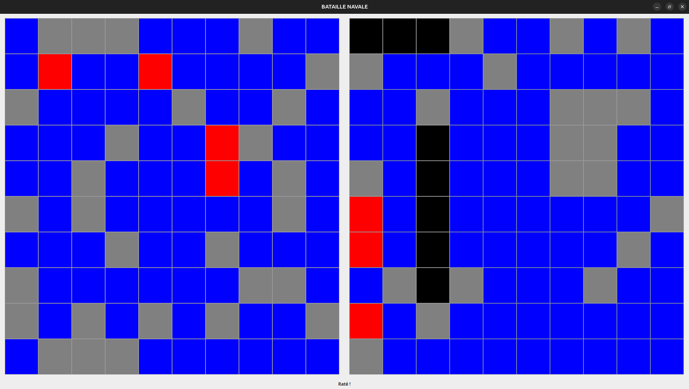
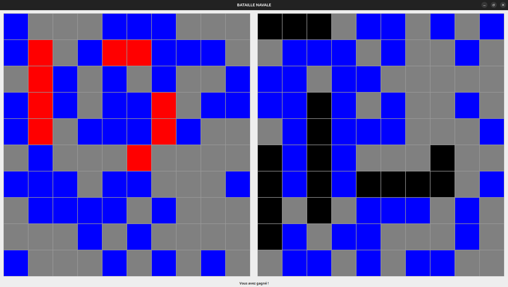
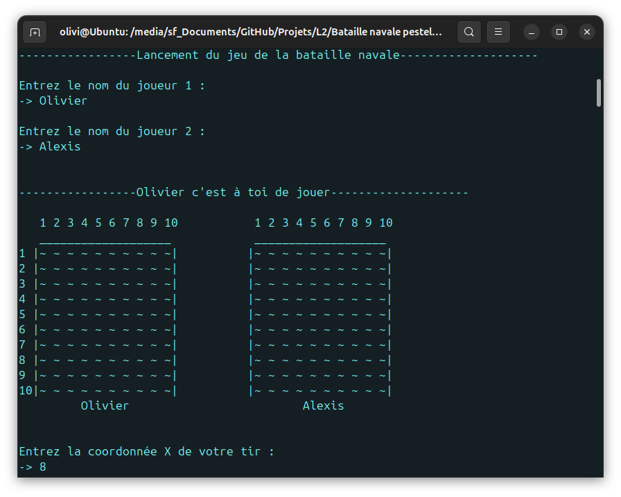
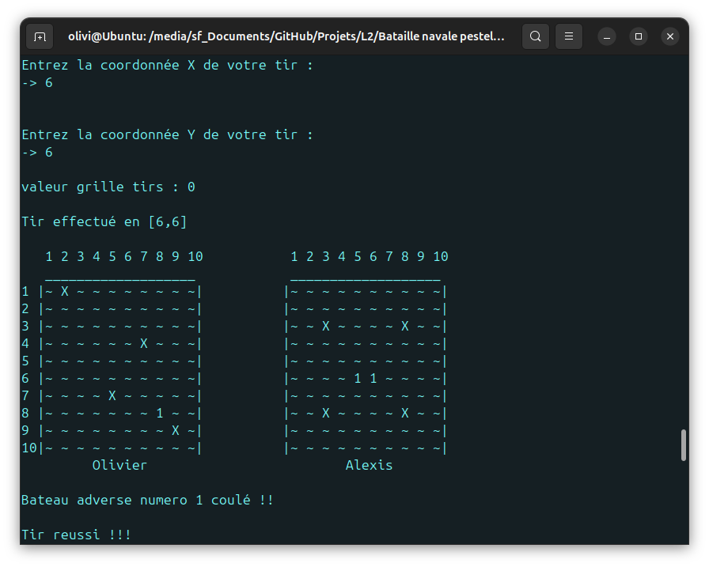

# Bataille-Navale
This game was developed in Java, where we experimented with graphical user interfaces using Swing and AWT. The boats are placed randomly, and the opponent's AI chooses its shots randomly as well. Our main focus was to allow the game to be played both in the console and through a graphical interface.

# Images

<table>
  <tr>
  	<td></td>
    <td></td>
    <td></td>
  </tr>
</table>

# Instructions
$ javac -d \"dist\" src/game/*.java $ java -cp \"dist\" [game.ExecutableInterface, game.ExecutableConsole]